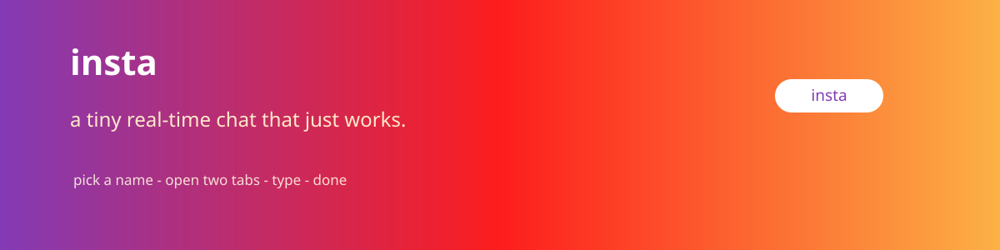

<p align="center">
  
</p>

<h1 align="center">insta ❤️</h1>

<p align="center">
  <b>a tiny real-time chat that just works.</b>
  <br/>Pick a name. Open two tabs. Type. Done. ✨
</p>

<p align="center">
  
  
</p>

---

Don't let the name fool you — **insta** is a happy little chat demo. No feeds, no stories,
no DMs you didn't ask for. Just messages that appear everywhere the moment you hit send. 🚀

## ✨ What it does

- 🎭 Drop-down your name (**Pranav** / **Naman**).
- ⚡ Send a message → it broadcasts to every open tab &amp; device, live.
- 🧼 Nothing stored — reload and it's a clean slate (by design).

## ▶️ Quick start

```bash
npm install
npm start        # → http://localhost:3000
```

To watch the magic, open a **second tab**, switch names, and message yourself. 🪄

### Chat with a friend (same Wi-Fi) 🏠
1. Server runs on one machine.
2. IP it up: `ifconfig | grep inet` (macOS/Linux) · `ipconfig` (Windows).
3. Other device opens `http://<that-IP>:3000` and picks a name.

## 🗂️ Where things live

| File | Job |
|---|---|
| `server.js` | Express + Socket.IO server, serves &amp; broadcasts |
| `public/index.html` | the chat screen |
| `public/script.js` | the client (sends + renders) |
| `public/style.css` | the looks |

> Not encrypted — built for a trusted little network, not the open internet. Use the vibe, not the vault. 😉

---

<p align="center">made for the "brb, testing" energy · rewā, india</p>